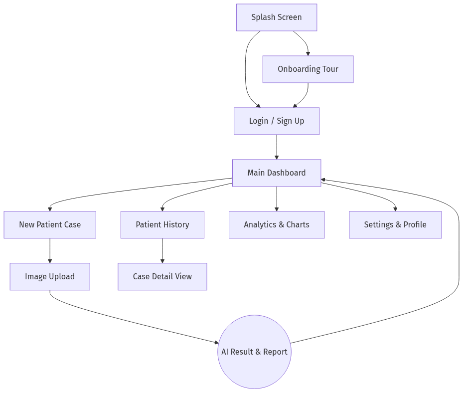
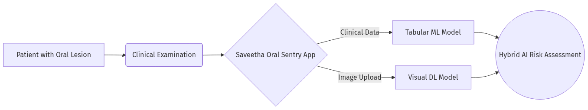
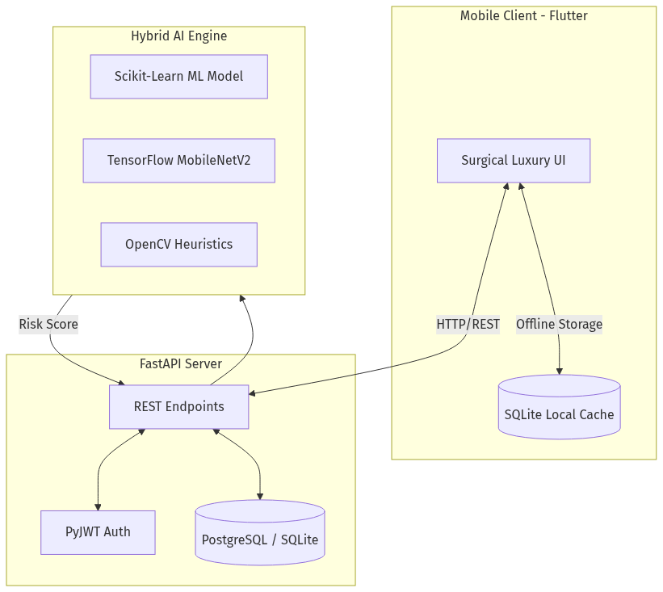

# Oral Ulcer AI (Saveetha Oral Sentry)

## 📖 About the Project
**Oral Ulcer AI (Saveetha Oral Sentry)** is a clinical-grade mobile application designed to assist dental professionals and clinicians in the early detection, risk assessment, and management of oral ulcers and potentially malignant oral disorders. 

The application serves as a clinical decision-support system that provides comprehensive risk analysis by combining clinical heuristic flags with advanced machine learning (for tabular clinical features) and deep learning (for visual image features). By identifying high-risk markers early, the app aids in expediting necessary biopsies and improving patient outcomes.

---

## 🏗️ Architecture & How We Built It
The project operates on a robust client-server architecture designed for reliability in clinical settings:

### 1. Frontend (Mobile App)
Built with **Flutter**, the mobile app provides a premium "Surgical Luxury" user interface with deep maroon and gold aesthetics. It features an offline-first design utilizing local SQLite caching. The frontend handles clinician authentication, patient onboarding, detailed clinical feature collection (demographics, lesion history, palpation findings), image capturing, and the visualization of AI results and analytics.

### 2. Backend (API & AI Inference)
Built with **Python and FastAPI**, the backend securely manages authentication, maintains patient and case records in a centralized database via SQLAlchemy, and exposes high-performance RESTful endpoints for AI predictions. 

### 3. AI Engine (Hybrid Scoring System)
The risk assessment is not a simple black box; it uses a transparent, hybrid approach:
- **Clinical Model**: A Scikit-Learn machine learning model (Random Forest / Logistic Regression) evaluates patient demographics, habits (tobacco/alcohol), lesion history, and clinical examination findings.
- **Visual Model**: A TensorFlow/Keras deep learning model (`MobileNetV2`) analyzes uploaded images of oral lesions for signs of malignancy.
- **Heuristic Flags**: OpenCV-based image heuristics (Erythema, Surface Texture, Edges) and clinical red-flag logical rules (e.g., duration > 3 weeks, fixed lymph nodes, induration) provide explainable "texture" to the AI's decision.
- **Final Score Calculation**: The system aggregates these inputs into a final prediction weighted as **60% Clinical AI + 40% Visual AI**, producing a final risk percentage and category.

---

## 💻 Tech Stack

### Mobile Frontend
- **Framework**: Flutter (Dart)
- **Local Database**: `sqflite` / `sqflite_common_ffi` (Local storage/caching)
- **Networking**: `http` (REST API communication)
- **Data Visualization**: `fl_chart` (Analytics and risk graphs)
- **Reporting**: `pdf` and `printing` packages (For clinical report generation)
- **Media**: `image_picker` (Camera and Gallery integration)

### Backend & AI
- **Framework**: FastAPI (Python)
- **Machine Learning**: `scikit-learn` (Clinical Tabular Model), `pandas`, `numpy`
- **Deep Learning**: `tensorflow` (Visual Image Model - MobileNetV2 `oral_risk_mobilenet.h5`)
- **Computer Vision**: `OpenCV` (`cv2`), `Pillow` (PIL) for heuristic image analysis
- **Database / ORM**: `SQLAlchemy`, `psycopg2-binary` (PostgreSQL / SQLite compatibility)
- **Security**: `passlib[bcrypt]` (Password hashing), `PyJWT` (Stateless token authentication)
- **Notifications**: `smtplib` (Gmail SMTP for OTP password resets)

---

## 🚀 End-to-End Workflow (What We Have Done)

From start to finish, we have implemented a complete, clinical-grade pipeline:

1. **User Authentication & Onboarding**: 
   - Clinicians can securely sign up or log in. 
   - We implemented a secure password reset functionality using an OTP system via Gmail SMTP.
   - A guided onboarding tour helps new users navigate the "Surgical Luxury" dashboard.

2. **Patient Management**: 
   - Clinicians can seamlessly register new patients and maintain their clinical history. 
   - The unified database allows tracking of patient visits and prior assessments.

3. **Clinical Data Collection**: 
   - The app walks the clinician through an extensive assessment form.
   - Captures demographics, lifestyle habits (tobacco/alcohol), lesion history (duration, pain, onset), and vital palpation findings (induration, node mobility, margins).

4. **Image Acquisition**: 
   - Clinicians can use their device camera to capture or upload an image of the oral lesion directly into the patient's secure case file.

5. **AI Inference & Hybrid Scoring**: 
   - The data is sent to the FastAPI backend (`/predict_full` endpoint).
   - The `clinical_model.pkl` calculates the tabular risk.
   - The `oral_risk_mobilenet.h5` model analyzes the image.
   - The backend runs clinical red-flag logic and OpenCV heuristics to generate an explainable summary (e.g., "Ill-defined lesion margins", "Intense Erythema Detected").
   - The system aggregates this into a final Risk Percentage.

6. **Result Visualization**: 
   - The clinician is immediately presented with a risk category (**Low**, **Intermediate**, or **High**).
   - The app provides actionable biopsy recommendations and a detailed breakdown of the exact risk factors that contributed to the score, ensuring the AI acts as an explainable assistant rather than an opaque oracle.

7. **Analytics & Reporting**: 
   - The dashboard provides a complete history of cases.
   - The analytics page visually graphs risk distributions over time. 
   - Clinicians can export these detailed findings as PDF reports for physical patient records or referrals.

#### 📱 App Screen Flow Diagram

---

## 📜 Academic Poster Content

### INTRODUCTION

#### Concept Overview Diagram

1. **AIM:** To develop an accurate, offline-capable clinical decision support system utilizing a hybrid AI approach to detect and assess the risk of oral ulcers and potentially malignant disorders.
2. **Importance:** Early detection of oral potentially malignant disorders significantly improves patient prognosis and survival rates, while reducing unnecessary biopsies.
3. **Application:** A mobile application utilized by clinicians during routine oral examinations to obtain real-time, explainable risk assessments.
4. **Features of Algorithm:** 
   - Hybrid Scoring: Combines tabular clinical data (Machine Learning) and visual data (Deep Learning).
   - Explainability: Uses heuristic visual flags (e.g., Erythema) and clinical red-flags (e.g., Chronicity).
5. **Data set used:** Patient demographic data, clinical history, palpation findings, and annotated images of oral lesions used to train the clinical (`clinical_model.pkl`) and visual (`oral_risk_mobilenet.h5`) models.

### MATERIALS AND METHODS
1. **Architecture Diagram of processing:**

2. **Explanation to solve the research Gap:** 
   Existing solutions often rely solely on "black-box" visual models, ignoring crucial patient history. Our system bridges this gap by combining visual deep learning with clinical data and rule-based heuristics to provide a robust, explainable hybrid score.

### RESULTS
1. **Graph:** The dashboard features a comparative bar graph (`fl_chart`) illustrating the distribution of Low, Intermediate, and High-risk cases, along with the patient's individual trajectory over time.
2. **Testing procedure:** Clinical testing involved validating the ML model against verified histopathological reports, ensuring the hybrid risk score (>75% indicating High Risk) aligns with real-world diagnostic urgency.
3. **Significant value explanation:** The system emphasizes high recall to minimize false negatives, assigning heavier weights to critical clinical red-flags (e.g., node mobility, induration) to ensure malignant cases are flagged for immediate biopsy.

### DISCUSSION AND CONCLUSION
1. **Accuracy details:** The hybrid algorithm enhances overall diagnostic confidence by cross-verifying the visual predictions of the MobileNetV2 architecture with the statistical predictions of the clinical Random Forest model.
2. **Future scope, factor affecting, limitation:** 
   - *Future Scope:* Integration with cloud-based federated learning for continuous model improvement.
   - *Factors Affecting:* Quality of captured images (lighting, focus) and subjectivity in clinician input.
   - *Limitation:* The system is an assistive tool and cannot definitively replace a histopathological biopsy.
3. **Conclusion:** The Saveetha Oral Sentry successfully integrates a multifaceted AI approach into a secure, user-friendly mobile platform, offering clinicians a reliable, explainable second opinion that can streamline the oral cancer screening process.

### BIBLIOGRAPHY
- Relevant literature on Oral Squamous Cell Carcinoma and Potentially Malignant Disorders.
- TensorFlow/Keras and Scikit-Learn documentation for machine learning frameworks.
- Flutter documentation for cross-platform mobile development.
